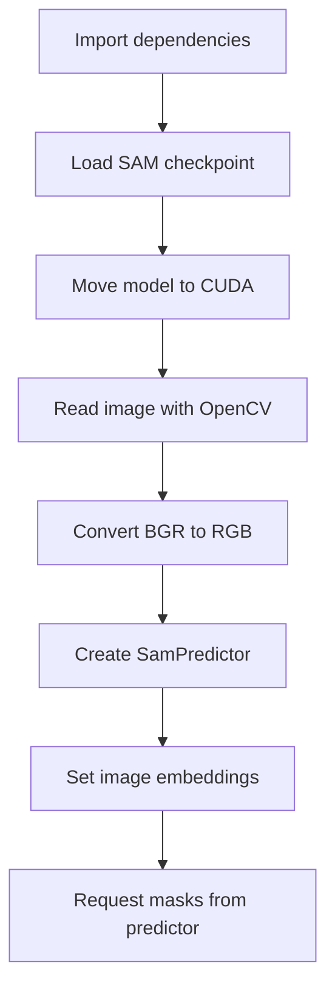

# MetaSAM

MetaSAM is currently a small prototype repository built around Meta's Segment Anything Model (SAM). In its present form, the project consists of a single Python script, [`sam.py`](./sam.py), that loads a SAM checkpoint, reads an image from disk, prepares the image for inference, and attempts to generate segmentation masks.

The codebase is best understood as an early experiment rather than a finished application. The script captures the basic shape of a SAM inference pipeline, but it also hard-codes local paths, assumes CUDA is available, and uses a prompt style that does not clearly match the standard `SamPredictor` interface.

## Documentation Map

- [Architecture](./docs/architecture.md)
- [Implementation Guide](./docs/implementation-guide.md)
- [Project Status and Limitations](./docs/project-status.md)

## Repository Layout

```text
MetaSAM/
|-- README.md
|-- sam.py
|-- ioana-ye-5EkUELLjYEI-unsplash.jpg
`-- docs/
    |-- architecture.md
    |-- implementation-guide.md
    `-- project-status.md
```

## High-Level Overview

The current script performs five major steps:

1. Import SAM and OpenCV dependencies.
2. Build the `vit_h` SAM model from a local checkpoint.
3. Move the model to a CUDA device.
4. Load and color-convert an input image.
5. Create a predictor and request masks.



## Current Entry Point

The entire implementation lives in [`sam.py`](./sam.py). There is no CLI, configuration layer, package structure, test suite, or output persistence. Running the script therefore depends on editing its hard-coded values or mirroring the same directory layout on the target machine.

## Intended Use

Based on the code, the likely intended workflow is:

- Load a pretrained SAM checkpoint.
- Read an example image.
- Prompt the model for a target object or region.
- Return one or more segmentation masks.

The implementation already covers checkpoint loading and image preparation. Prompt handling and output handling are still incomplete in practice.

## Quick Technical Summary

- Language: Python
- Core model dependency: `segment_anything`
- Image processing dependency: OpenCV (`cv2`)
- Compute assumption: NVIDIA GPU with CUDA
- Input style in code: local image path plus a string prompt
- Output style in code: in-memory mask tensor or NumPy array assigned to `masks`

## Recommended Next Steps

If this repository is going to evolve beyond a prototype, the highest-value improvements are:

1. Replace hard-coded filesystem paths with arguments or config.
2. Clarify the supported prompt type and implement it consistently.
3. Add output saving or visualization for predicted masks.
4. Add environment setup instructions and dependency pinning.
5. Split the script into reusable functions or modules.
6. Add tests for image loading and inference-path validation.

## Snapshot of the Current Script

The present code does the following:

- `sam_model_registry["vit_h"](...)` loads a large SAM backbone from a local checkpoint.
- `sam.to(device="cuda")` assumes GPU execution.
- `cv2.imread(...)` loads the input image in BGR layout.
- `cv2.cvtColor(..., cv2.COLOR_BGR2RGB)` converts the image to the RGB format expected by most vision pipelines.
- `SamPredictor(sam)` creates an inference helper around the loaded model.
- `predictor.set_image(img)` computes and stores image embeddings for later prompt-based mask generation.
- `predictor.predict("hand")` attempts to request masks from the predictor.

For a deeper explanation of how those pieces interact, see [Architecture](./docs/architecture.md) and [Implementation Guide](./docs/implementation-guide.md).
