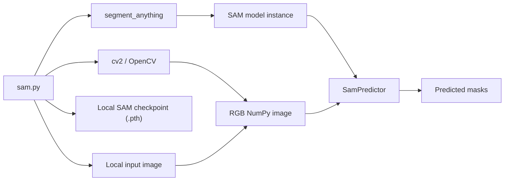
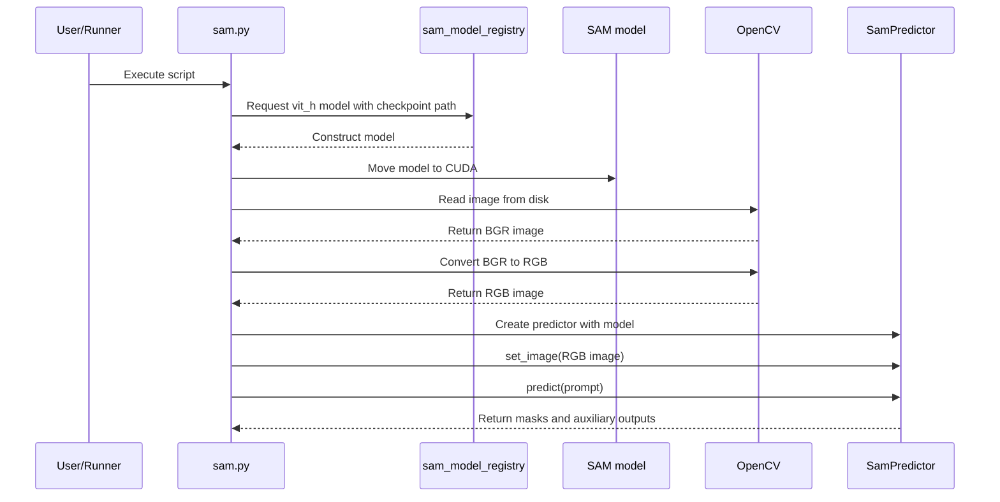
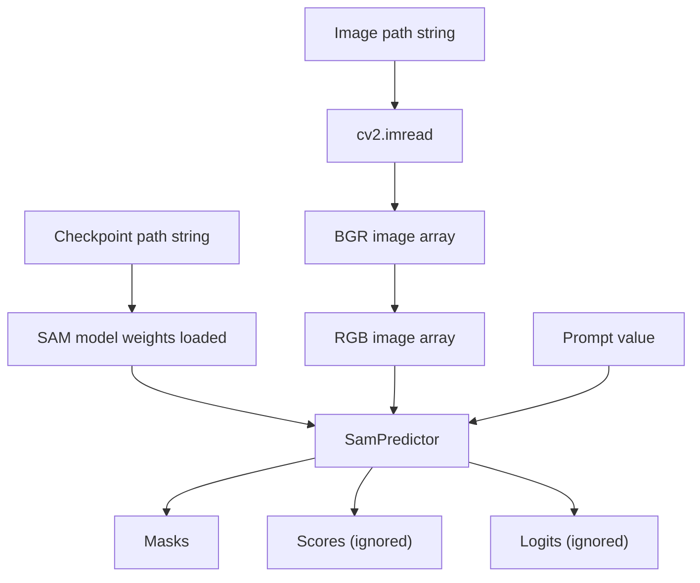
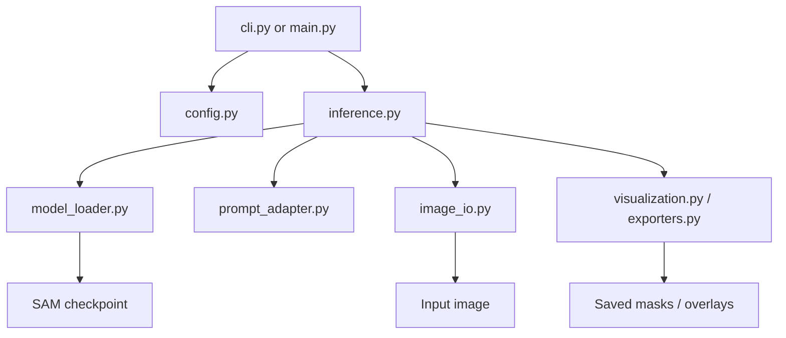

# Architecture

## Overview

MetaSAM currently has a flat architecture: one script orchestrates all work from model loading to inference. There are no internal modules yet, so the architecture is best documented as a runtime pipeline rather than a package diagram.

## Current Component Model

## Execution Pipeline

The runtime behavior is linear and synchronous:

## Architectural Layers

Even though the repository has only one file, the code still falls into conceptual layers:

### 1. Dependency Layer

External libraries provide almost all functionality:

- `segment_anything` supplies the model registry and predictor wrapper.
- `cv2` supplies image file loading and color conversion.

### 2. Configuration Layer

Configuration is currently embedded directly in source code:

- SAM checkpoint path
- input image path
- prompt value
- compute device

Because these values are hard-coded, configuration is not reusable across machines or datasets.

### 3. Inference Layer

Inference is handled through:

- model construction via `sam_model_registry`
- device placement via `sam.to(...)`
- image embedding setup via `predictor.set_image(...)`
- mask generation via `predictor.predict(...)`

### 4. Output Layer

The output layer is minimal. Masks are produced and assigned to `masks`, but the script does not:

- save them to disk
- visualize them
- post-process them
- return them through a function or CLI

## Data Flow

## Design Observations

### Strengths

- The script follows the standard broad shape of a SAM inference path.
- Image color conversion is handled explicitly.
- The code is small and easy to reason about.

### Structural Weaknesses

- The project is not packaged; all responsibilities are mixed in one file.
- Runtime configuration is tied to one developer's local filesystem.
- There is no abstraction for different prompt types.
- There is no reusable API surface for downstream code.
- There is no error handling around missing files, missing CUDA, or invalid outputs.

## Recommended Future Architecture

If the repository grows, a lightweight modular structure would make the project easier to document and maintain:

A structure like this would separate concerns cleanly:

- `config.py` for paths, device, and runtime options
- `model_loader.py` for checkpoint resolution and SAM initialization
- `image_io.py` for image reading and preprocessing
- `prompt_adapter.py` for point, box, or other prompt conversion
- `inference.py` for predictor orchestration
- `visualization.py` for saving or displaying masks

## Architecture Summary

The current repository has a valid prototype shape but not yet a production shape. Its architecture is simple enough to understand immediately, which is useful for experimentation, but the same simplicity also means configuration, inference, and output concerns are tightly coupled.
