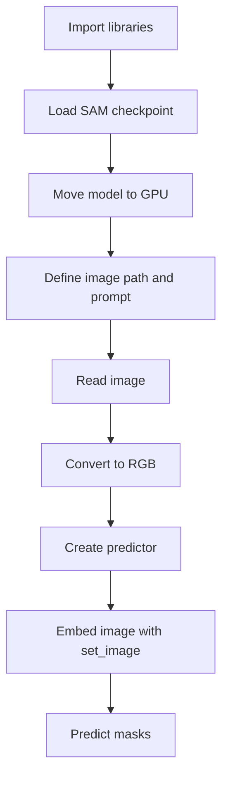

# Implementation Guide

## File-by-File Walkthrough

The repository currently contains one implementation file: [`sam.py`](../sam.py).

## Code Walkthrough

### Imports

```python
from segment_anything import SamPredictor, sam_model_registry
import cv2
```

The script depends on:

- `segment_anything` for SAM model construction and prediction
- `cv2` for image loading and color conversion

### Model Construction

```python
sam = sam_model_registry["vit_h"](checkpoint="/home/nidhi/code/Meta-SAM/sam_vit_h_4b8939.pth")
sam.to(device="cuda")
```

This section:

- selects the `vit_h` backbone from the model registry
- loads model weights from a local `.pth` checkpoint
- places the model on a CUDA device

Implications:

- the checkpoint must exist at the specified absolute path
- the runtime must have a CUDA-capable environment
- the largest SAM backbone is being used, which has higher compute and memory cost than smaller variants

### Input Definition

```python
img_path = "/home/nidhi/code/Meta-SAM/ioana-ye-5EkUELLjYEI-unsplash.jpg"
prompt = "hand"
```

This is the script's entire runtime configuration. It fixes both the image path and the prompt directly in the source file.

That makes the script easy to read, but it also means:

- there is no support for batch processing
- a different machine will need code edits before the script can run
- prompt semantics are not documented in code

### Image Loading

```python
img = cv2.imread(img_path)
img = cv2.cvtColor(img, cv2.COLOR_BGR2RGB)
```

OpenCV reads image data in BGR channel order by default. The explicit conversion to RGB is important because most SAM workflows expect RGB-formatted images.

Potential failure points:

- `cv2.imread(...)` may return `None` if the file does not exist or cannot be decoded
- `cv2.cvtColor(...)` will fail if `img` is `None`

### Predictor Setup

```python
predictor = SamPredictor(sam)
predictor.set_image(img)
```

This stage wraps the base model in a predictor helper and prepares image embeddings. Conceptually, `set_image(...)` turns the raw image into a form that can be queried repeatedly with prompts.

This is a useful design choice because:

- image embedding work is separated from prompt-specific prediction work
- the same image can be queried multiple times if the script is expanded later

### Prediction Call

```python
masks, _, _ = predictor.predict("hand")
```

This line is the least settled part of the current implementation.

From the surrounding code, the project intent appears to be: supply a text prompt such as `"hand"` and retrieve masks for the referenced region. However, the standard `SamPredictor` interface is typically used with geometric prompts such as:

- point coordinates plus point labels
- bounding boxes
- mask priors

So this call should be treated as a prototype placeholder unless the local `segment_anything` package in use has been extended beyond the common public API.

## Control Flow Summary



## Runtime Requirements

The script implicitly requires:

- Python
- the `segment_anything` package
- OpenCV Python bindings
- a downloaded SAM checkpoint file
- an accessible local image file
- CUDA-capable hardware and software stack

## Expected Inputs and Outputs

### Inputs

- a local checkpoint file path
- a local image file path
- a prompt value

### Outputs

- `masks`: predicted segmentation mask data
- two additional return values that are currently ignored

Because the script does not persist results, the outputs exist only in memory for the duration of the process.

## Suggested Refactoring Path

The code can be improved without changing its core purpose:

1. Wrap the top-level script into a `main()` function.
2. Move checkpoint path, image path, and device into arguments.
3. Add validation for missing files and unsupported devices.
4. Clarify prompt type and rename `prompt` if it is not text-based.
5. Save predicted masks as images or overlay visualizations.
6. Return structured results instead of storing only local variables.

## Example of a Cleaner Script Structure

The following is not the current implementation, but it shows how the existing script could be organized more cleanly:

```python
def load_model(checkpoint_path: str, device: str):
    sam = sam_model_registry["vit_h"](checkpoint=checkpoint_path)
    sam.to(device=device)
    return sam

def load_image(image_path: str):
    img = cv2.imread(image_path)
    if img is None:
        raise FileNotFoundError(image_path)
    return cv2.cvtColor(img, cv2.COLOR_BGR2RGB)

def run_inference(model, image, prompt):
    predictor = SamPredictor(model)
    predictor.set_image(image)
    return predictor.predict(prompt)
```

That structure would make the code more testable and would also make future documentation easier.
