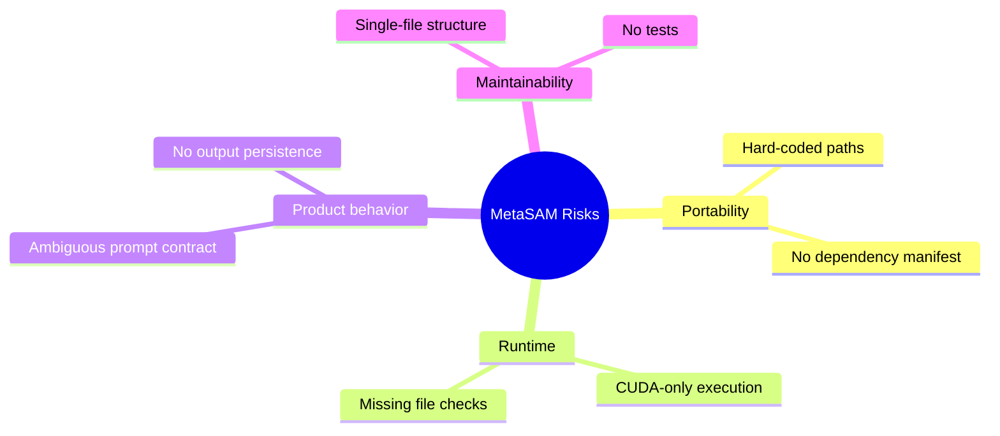
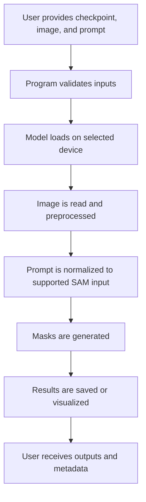

# Project Status and Limitations

## Current Maturity

MetaSAM is presently a proof-of-concept repository. It demonstrates the outline of a Segment Anything inference workflow, but it does not yet provide a complete, portable, or user-friendly application.

## What Works at a Structural Level

The script already shows the following core ideas:

- importing and initializing a SAM model
- moving the model to GPU
- loading image data with OpenCV
- preparing the image for model consumption
- invoking predictor-based mask generation

These are the right building blocks for a segmentation prototype.

## Current Constraints

### 1. Hard-Coded Local Paths

The checkpoint path and image path both point to a specific machine-local directory:

- `/home/nidhi/code/Meta-SAM/sam_vit_h_4b8939.pth`
- `/home/nidhi/code/Meta-SAM/ioana-ye-5EkUELLjYEI-unsplash.jpg`

This means the script is not portable as checked into the repository.

### 2. Implicit CUDA Requirement

The line `sam.to(device="cuda")` assumes:

- CUDA is installed
- a compatible GPU is available
- the Python environment can access that GPU

There is no CPU fallback and no runtime guard.

### 3. Missing Dependency Manifest

The repository currently does not include:

- `requirements.txt`
- `pyproject.toml`
- `environment.yml`
- setup instructions

As a result, environment recreation depends on outside knowledge.

### 4. Unclear Prompt Semantics

The variable name `prompt` suggests text prompting, but the standard SAM predictor flow is generally built around spatial prompts. Without additional adapter code or a modified SAM package, the current prompt behavior is ambiguous.

### 5. No Result Visualization or Persistence

The script creates `masks`, but it does not:

- write them to disk
- overlay them on the source image
- display them
- return them through a documented interface

### 6. No Error Handling

The script does not check:

- whether the checkpoint file exists
- whether the image file exists
- whether OpenCV successfully loaded the image
- whether CUDA is available
- whether prediction succeeded

## Risk Areas

## Documentation Implications

Because the codebase is so small, the most useful documentation is not a long API reference. The most useful documentation is:

- an accurate explanation of the runtime flow
- explicit recording of assumptions
- clarification of what the project is and is not yet
- a roadmap for converting the script into a reusable tool

That is why this documentation set focuses on architecture, implementation behavior, and current limitations.

## Near-Term Improvement Priorities

The best next steps, in order, are:

1. Add a dependency manifest.
2. Parameterize checkpoint and image paths.
3. Validate files and device availability before inference.
4. Clarify the supported prompt mode.
5. Save or display resulting masks.
6. Add a minimal README usage example and test coverage.

## Definition of a More Complete Version

The repository would feel substantially more complete if it supported the following workflow:

## Bottom Line

MetaSAM already communicates its intended direction clearly: it aims to run SAM on a local image and produce masks. What it lacks today is portability, explicit runtime configuration, clear prompt handling, and an output story. The current docs should therefore be read as documentation for a prototype snapshot, not for a fully packaged segmentation tool.
